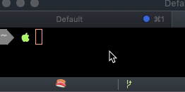

# SushiStatusBar

iTerm2 Status Bar for Sushi



## Install

```sh
git clone {this}
mkdir ~/Library/ApplicationSupport/iTerm2/Scripts/AutoLaunch/
ln -s ./SushiStatusBar ~/Library/ApplicationSupport/iTerm2/Scripts/AutoLaunch/SushiStatusBar
```

## License
Apache License Version 2.0